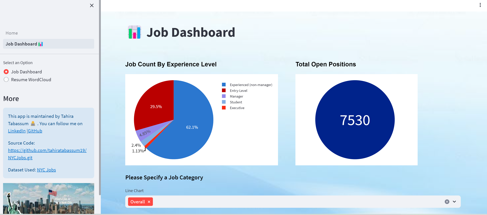

# NYC Jobs and Career Opportunities 
## Description

This project will allow the user to search jobs in NYC based on different filters. It also shows current job statistics in the city along with some user interactive visuals. User can create a quick wordcloud to check their overall qualification for any speicific role.

-----

## Tech Stacks 

- 📊Matplotlib
- 📊Pyplot
- ✍️PyPDF2
- 🔎Streamlit
- 🐼Pandas
- 🔠WordCloud
  
## Development Tools 

- Visual Studio
- Git & GitHub
- Postman
  
## Data
Live data comes from NYC Jobs data from NYC Open data. Data can be found <a href="https://data.cityofnewyork.us/City-Government/NYC-Jobs/kpav-sd4t">Here</a>

## Functionality 

### Job Search: 

#### To search for desired jobs user can search by dropdown filters giving option to select job category and job levels. Also user can specify any keyword to get more precise results Must click search button to check the results with job category, agency hiring , salary, date posted until, and experience level.

### Job Dashboard:

#### To check the current statistics of NYC jobs user must navigate with the second page where it will show a dashboard of total open positions based on different user entered filters. 

### Resume Cloud

#### User can try out a the resume cloud by uploading their resume in pdf or docx version to get bullet words to detemine if they are fit for the positions. 

## How to run
To run this app please get your own API_TOKEN from the dataset link provided above and store the API_TOKEN in the Home.py file instead of the secret key. 

